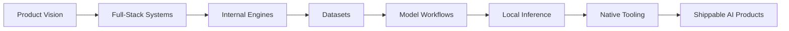

<div align="center">

# Starred

### Founder of OpenReason • Full-Stack Engineer • AI Engineer

<p>
  I build AI-native products, internal engines, datasets, and local model workflows.
</p>

<p>
  
  
  
  
</p>

</div>

---

## Profile

I work across product engineering, AI systems, native tooling, and model workflows.

My main stack is `TypeScript`, `React`, `Next.js`, `Vite`, `Node.js`, and `Python`, with `Rust` and `C++` for native tooling, runtime work, and performance-critical systems.

I am the founder of **OpenReason**, where I build AI-native products, internal engines, and high-agency software around practical execution rather than demo-only ideas.

## Tech Surface

<p>
  
</p>

## What I Build

- **OpenReason**: AI-native software, internal engine work, product systems, and execution-heavy tooling
- **Abelix**: codename for an engine-focused product and tooling direction
- **Asterix**: a next-generation model in the small-LLM class
- **Datasets / training workflows**: prompt libraries, behavior data, preparation pipelines, and execution-oriented dataset work
- **Local AI systems**: Qwen, `llama.cpp` forks, MNN conversion pipelines, runtime experiments, and performance-focused inference work
- **Not Applicable / N/A**: additional internal projects, product directions, and documents that are not publicly described

## Operating Range



## Current Focus

<table>
  <tr>
    <td><strong>Products</strong></td>
    <td>AI-native software that is actually useful in practice</td>
  </tr>
  <tr>
    <td><strong>Engines</strong></td>
    <td>Internal engine work for product and runtime capabilities</td>
  </tr>
  <tr>
    <td><strong>Models</strong></td>
    <td>Small-model and local-model workflows, runtime tuning, and integration</td>
  </tr>
  <tr>
    <td><strong>Datasets</strong></td>
    <td>Preparation pipelines, behavior libraries, and training-oriented assets</td>
  </tr>
  <tr>
    <td><strong>Native</strong></td>
    <td>Desktop, systems, and high-performance components when the product needs them</td>
  </tr>
</table>

## Background

- Founder of **OpenReason**
- Building across web, desktop, native, AI, and model-tooling layers
- Participant in the **Alibaba Cloud AI Catalyst Program**
- Working at the intersection of product systems, startup execution, and applied AI engineering

## Collaboration

I am open to collaboration in:

- AI products
- developer tools
- local inference and model tooling
- full-stack platforms
- desktop and native software
- applied research with a product direction

If the work is technically real, ambitious, and execution-heavy, I am interested.

## Snapshot

```text
Role        : Founder / Full-Stack Engineer / AI Engineer
Company     : OpenReason
Core Stack  : TypeScript, React, Next.js, Vite, Node.js, Python
Systems     : Rust, C++, Electron, Tauri, WebAssembly
Focus       : Products, engines, datasets, model workflows, local AI
Status      : Open to collaboration
```

---

### Short GitHub Bio

`Founder of OpenReason. Full-stack & AI engineer building products, engines, datasets, and local AI systems. TypeScript, React, Next.js, Vite, Python, Rust, C++. Alibaba Cloud AI Catalyst Program. Open to collaboration.`
