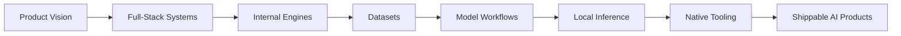

# OpenReason — Intelligence in the open

**Founder of OpenReason · Full-Stack Engineer · AI Engineer**

Reason more. Build beyond.

I build AI-native products, internal engines, datasets, and local model workflows. The lab lives at [openreason.net](https://openreason.net) — this profile is the workbench.

---

## Profile

I work across product engineering, AI systems, native tooling, and model workflows — and I ship the whole way: from ML research to LLM pipelines, from hello world to a full product in production.

My main stack is `TypeScript`, `React`, `Next.js`, `Vite`, `Node.js`, and `Python`, with `Rust` and `C++` for native tooling, runtime work, and performance-critical systems. Beyond the core stack, I ship in whatever language the task, architecture, or curiosity demands — from Kotlin to Zig. Everything else — languages, frameworks, runtimes, infra, weird experiments — ships as needed. If it exists, I've probably touched it. If it doesn't, I can build it.

I am the founder of **OpenReason**, an independent lab building the stack for spatial computing: models that see, language that reasons, and worlds that respond — software built around practical execution rather than demo-only ideas.

## Tech Surface

**Languages**


**Frontend & Web**


**Backend & Runtimes**


**AI / ML**


**Desktop & Native**


**Infra & Cloud**


**Data**


**Tooling**


## The Lab — OpenReason

- **Language** — spiking neural networks with temporal coding: language models that fire only on meaning. Works in small-scale runs; frozen while we look for sponsors — it needs compute, not ideas.
- **Vision** — hand tracking and spatial understanding from a single phone camera, tuned for mobile silicon.
- **Worlds** — **PhoneVR**: full six-degrees-of-freedom VR from the phone already in your pocket. Quest-level latency, no headset computer.

## The Iceberg — What I Build

Most of what I ship is **not for mortal eyes right now** — private repos, client work under NDA, research in stealth. The public part is the tip:

- **Abelix** — game engine with an AI agent inside. *(not OSS now)*
- **Asterix** — a new AI architecture: SNN + temporal coding. Potentially 10–20× smarter and cheaper than transformers — not verified yet, because no budget has been allocated.

## Research Threads

Long-running research lines that inform the lab's direction:

| Thread | Question | Status |
|--------|----------|--------|
| **Temporal SNNs** | Can language models fire only on meaning, not on every token? | Prototype runs ✅, compute-bound 🟡 |
| **Mobile Spatial Perception** | Can one phone camera replace a full depth rig? | Working on-device ✅ |
| **Headset-free VR** | Can a phone alone deliver Quest-class 6DoF? | Latency-tuned ✅ |
| **Local Inference** | Can small models outperform cloud LLMs on narrow tasks? | In production ✅ |
| **Agent Engines** | Can a game engine host autonomous AI agents reliably? | Private ✅ |

## Shipment Types

What I typically build:

- 🧠 **AI-native products** — LLM agents, reasoning pipelines, tool-augmented systems
- ⚡ **Internal engines** — runtime substrates, agent hosts, inference layers
- 📊 **Datasets** — preparation pipelines, behavior libraries, training assets
- 🖥️ **Desktop / native tools** — Tauri & Electron apps, WASM modules, performance-critical components
- 🌐 **Full-stack products** — dashboards, SaaS, landing pages, internal tools
- 📱 **Mobile / XR** — phone-first spatial apps, camera-native perception

## Operating Range



## Current Focus

| Area | Description |
|------|-------------|
| **Products** | AI-native software that is actually useful in practice |
| **Engines** | Internal engine work for product and runtime capabilities |
| **Models** | Small-model and local-model workflows, runtime tuning, and integration |
| **Datasets** | Preparation pipelines, behavior libraries, and training-oriented assets |
| **Native** | Desktop, systems, and high-performance components when the product needs them |

## Workflow

- **Async first** — text and artifacts over meetings. Calls are available when useful.
- **Spec → build → ship** — tight loops, visible commits, working software as the report.
- **Private by default** — most work is NDA or stealth; public repos are the tip of the iceberg.
- **Local-first where possible** — inference, rendering, and state prefer the user's machine.

## Philosophy

- **Ship, then perfect.** Working software beats perfect slides.
- **Small models, sharp edges.** Local inference wins when the problem is narrow.
- **Native when it matters.** Web is the default, native is the escape hatch for speed.
- **Execution over opinion.** Real code, real users, real feedback.

## What I Don't Do

- No demo-only work without a path to production.
- No pure content farms, SEO spam, or ad-tech.
- No meetings-first processes — async by default, voice on request.

## Backed By

<p align="center">
  
</p>

OpenReason is part of the **Alibaba Cloud AI Catalyst Program** — infrastructure and compute partner for the lab's research and product work.

## Background

- Founder of **OpenReason** — [openreason.net](https://openreason.net)
- Building across web, desktop, native, AI, and model-tooling layers
- Supported by the **Alibaba Cloud AI Catalyst Program**
- Working at the intersection of product systems, startup execution, and applied AI engineering

## Stats

| Metric | Value |
|--------|-------|
| Daily site requests | ~5,000 |
| Daily AI-driven requests | ~500 |
| Unique visitors / day | Higher than raw metrics suggest |
| Ad spend | $0 |
| Public repos | Tip of the iceberg |

## Collaboration

Open to collaboration in: AI products, developer tools, local inference and model tooling, full-stack platforms, desktop and native software, applied research with a product direction.

From ML to LLM, from hello world to a full application — if the work is technically real, ambitious, and execution-heavy, I am interested.

## Contact Flow

1. **Text first** — email with the task or a short description.
2. **Async by default** — replies in text, code, or artifacts.
3. **Voice on request** — calls are fine when they actually help.

📬 **sales@openreason.net**

## Snapshot

```text
Role        : Founder / Full-Stack Engineer / AI Engineer
Company     : OpenReason — openreason.net
Core Stack  : TypeScript, React, Next.js, Vite, Node.js, Python
Systems     : Rust, C++, C, Go, Kotlin, Zig, Electron, Tauri, WASM
Focus       : Products, engines, datasets, model workflows, local AI
Visibility  : Most work private / NDA — public repos are the tip
Backed by   : Alibaba Cloud AI Catalyst Program
Status      : Open to collaboration
```

---

### Short GitHub Bio

Founder of OpenReason (openreason.net). Full-stack & AI engineer: products, engines, datasets, local AI. From ML to LLM, hello world to shipped products. TS, React, Next.js, Python, Rust, C++, Kotlin, Zig. Supported by Alibaba Cloud AI Catalyst Program. Portfolio: github.com/StarryCod/OpenReason